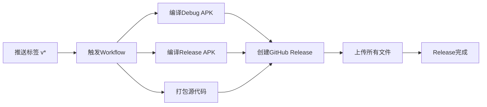

# 📦 MQTT Wss Android App - Release 发布指南

## 🎯 概述

本项目已配置自动化Release流程，当推送版本标签时，GitHub Actions会自动：
1. 编译Debug和Release版本的APK
2. 打包源代码
3. 创建GitHub Release并上传所有文件

## 🚀 快速开始

### 方法一：使用PowerShell脚本（推荐）

```powershell
# 在项目根目录运行
.\create-release.ps1 -Version "1.0.0" -Message "首次正式发布"
```

### 方法二：手动创建

```bash
# 1. 更新版本号（在 app/build.gradle 中）
# versionCode 100
# versionName "1.0.0"

# 2. 提交更改
git add app/build.gradle
git commit -m "Bump version to 1.0.0"

# 3. 创建标签
git tag -a v1.0.0 -m "首次正式发布"

# 4. 推送代码和标签
git push origin master
git push origin v1.0.0
```

## 📋 Release 包含内容

每次Release会自动包含以下文件：

| 文件名 | 说明 | 用途 |
|--------|------|------|
| `app-debug.apk` | Debug版本APK | 开发测试，包含调试信息 |
| `app-release.apk` | Release版本APK | 正式发布，经过优化 |
| `source-code.tar.gz` | 源代码压缩包 | 完整项目源码 |

## 🔧 前置要求

### 1. GitHub Secrets 配置

如果要生成签名的Release APK，需要在GitHub仓库设置以下Secrets：

- `RELEASE_KEYSTORE_BASE64` - Keystore文件的Base64编码
- `RELEASE_STORE_PASSWORD` - Keystore密码
- `RELEASE_KEY_ALIAS` - Key别名
- `RELEASE_KEY_PASSWORD` - Key密码

**如果不配置这些Secrets**，Release构建会使用Debug签名，APK仍可正常安装使用。

### 2. 生成Keystore（可选）

```bash
# 生成release keystore
keytool -genkey -v \
  -keystore release-keystore.jks \
  -alias my-key-alias \
  -keyalg RSA \
  -keysize 2048 \
  -validity 10000
```

然后将keystore文件转换为Base64并添加到GitHub Secrets。

## 📊 工作流程



## 🎉 首次Release示例

```powershell
# 创建第一个正式版本
.\create-release.ps1 -Version "1.0.0" -Message "🎉 首次正式发布 - MQTT Wss Android客户端"
```

执行后：
1. ✅ 自动更新版本号为1.0.0
2. ✅ 创建git标签v1.0.0
3. ✅ 推送到GitHub
4. ✅ 触发GitHub Actions构建
5. ✅ 自动创建Release并上传文件
6. ✅ 可在 https://github.com/poiuy105/mqttWss/releases 查看

## 📝 版本命名规范

建议使用语义化版本控制：

- **主版本**.次版本.修订版本 (例如: 1.0.0, 1.1.0, 1.1.1)
- **预发布版本**: 1.0.0-alpha, 1.0.0-beta, 1.0.0-rc1

## 🔍 查看构建状态

```bash
# 查看最近的workflow运行
gh run list --limit 5

# 查看特定workflow
gh run list --workflow=create-release.yml
```

## ❓ 常见问题

### Q: Release构建失败怎么办？
A: 检查GitHub Actions日志，常见原因：
- Secrets配置错误
- 编译错误
- 网络问题

### Q: 可以重新发布同一个版本吗？
A: 不可以。需要先删除标签和Release，然后重新创建。

### Q: Debug和Release版本有什么区别？
A: 
- **Debug**: 包含调试信息，未优化，适合测试
- **Release**: 经过优化和混淆，体积小，性能好，适合发布

## 📞 支持

如有问题，请查看：
- [GitHub Issues](https://github.com/poiuy105/mqttWss/issues)
- [GitHub Actions日志](https://github.com/poiuy105/mqttWss/actions)

---

**祝发布顺利！🚀**
